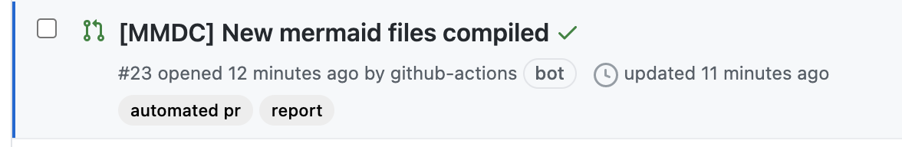
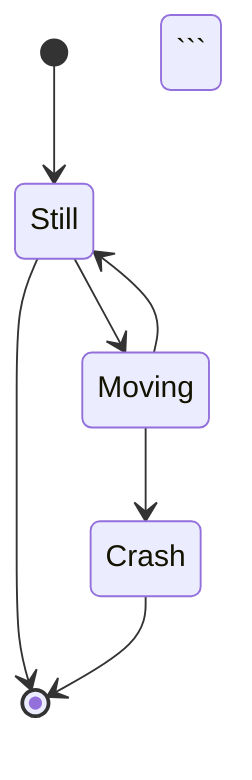
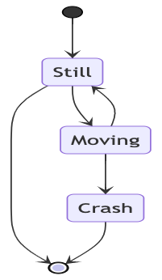

# Mermaid

Mermaid lets you represent diagrams using text and code. This simplifies maintaining complex diagrams. It is a Javascript based diagramming and charting tool that renders Markdown-inspired text
definitions to create and modify diagrams dynamically. The main purpose of Mermaid is to help Documentation catch up with Development.

It is an open-sourced JS based rendering tool and can be found [here](https://github.com/mermaid-js/mermaid)

## Rendering

Mermaid has its own syntax to visualize charts/graphs for markdown files. For more examples, please have a look on their
documentation [page](https://mermaid-js.github.io/mermaid/#/n00b-gettingStarted).

VSCode has several extensions where you can install and see rendered copy.

Github doesn't support client-side rendering yet, and we need to have PNG files for rendered copies. To automate this, we have a Github Action based
automation [here](.github/workflows/mermaid.yml).

## Github Action

Once you added/updated any mermaid based diagram on any markdown files, Github Action will be triggered, and it will compile PNG files for us. There will be new PR raised by `github-action` and author
of main PR has to check and merge to main PR.

Each time when you update your PR, `mermaid` files will be compiled again and automated PR will be updated. It is better to merge compiled copies after getting approval to main PR.



On your main PR, visual copies would be outdated or not rendered yet. In order to make easy reviews, rendered copies can be merged before review OR shared as in the PR description.

Please add an empty link before your diagram because `Github Action` will try to replace the rendered copy in your markdown file.

## Examples

Each mermaid diagram has to be quoted as code block. Don't forget to use
syntax [highlighting](https://docs.github.com/en/free-pro-team@latest/github/writing-on-github/creating-and-highlighting-code-blocks#syntax-highlighting). It should be marked as `mermaid`.

### Source

```


### Rendered


